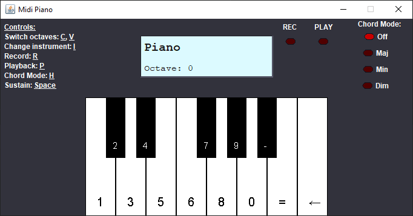

# Лабораторна робота MIDI-piano

Метою цієї роботи є закріплення знання з написання специфікацій та використання кінцевих автоматів для розробки програмного забезпечення

## Теоретичні відомості

### Завданням на лабораторну роботу є реалізація простого MIDI-синтезатора на базі клавіатури ПК, який повинен володіти наступними можливостями:

1. Програвати музичні ноти за допомогою клавіш на клавіатурі комп'ютера
2. Імітувати різноманітні інструменти
3. Програвати ноти в різних октавах
4. Записувати послідовності нот та потім їх відтворювати.

Для полегшення виконання завдання надається [каркас програми](https://github.com/TNTU-121-Software-Engineering/SE211-Software-Construction/tree/main/Lab-2/lab-2-project), що містить класи для реалізації взаємодію з midi-пристроєм, абстракції музичних нот і базову структуру Java GUI для вазємодії користувача. GUI викликає декілька методів класу PianoMachine. Також створений метод Midi.history(), який зберігає текстовий ввід і може бути корисним для процедури відладки.

### Приклад для UI ПЗ що маєте отримати в результаті виконання лабораторної

### Вимоги до реалізації

#### Вимога A

Міді-синтезатор повинен дозволяти програвати деякий набір нот (pitches) {C, C #, D, ... # B} за допомогою клавіш {'1 ', '2', ... '-', '='}. Відповідно, коли одна з цих клавіш натиснута, повинна зазвучати нота, якщо вона ще не звучить до цього, те ж саме, при відпусканні клавіші, нота повинна перестати звучати, якщо вона звучала до цього. Для реалізації цього функціоналу, створені сигнатури відповідних методів PianoMachine.beginNote і PianoMachine.endNote, які будуть викликатися відповідно при натисненні та при відпусканні клавіші. Використовуйте ці методи як точки входу у вашій реалізації.

Початковий код програми доступний в каталозі `Lab-2/lab-2-project` цього репозиторію. Ознайомтесь з `Lab-2/lab-2-project/README.md`

**Завдання:**

1. Написати специфікації для методів PianoMachine.beginNote і PianoMachine.endNote, а також для усіх допоміжних методів, які будуть використовуватися.
2. Написати тести для перевірки роботи цих методів
3. Реалізувати необхідний функціонал методів PianoMachine.beginNote і PianoMachine.endNote та необхідних допоміжних методів. Як відправну точку зроблено попередню реалізація цих методів, яка завжди програє ноту ‘C’.

#### Вимога B

MIDI-синтезатор повинен уміти перемикати MIDI-інструменти. Клавіша ‘І’ повинна виконувати перемикання MIDI-інструмента на наступний у переліку доступних або починати з першого, якщо перелік вичерпано.

В наданій реалізації, клавіша ‘I’ прив’язана до методу PianoMachine.changeInstrument, в якому можна реалізовувати необхідний функціонал.

**Завдання:**

1. Написати специфікація для методу changeInstrument та для усіх допоміжних методів
2. Написати тести для цих методів
3. Додати новий стан до автомата PianoMachine, що відображатиме режим інструменту, вибраного в методі changeInstrument і відповідним чином змінити інші методи, який це торкатиметься. Перелік інструментів знаходиться в enum Instrument пакету midi.

#### Вимога С

Натиснення клавіш ‘C’ і ‘V’ повинне зсувати поточну ноту відповідно вверх або вниз на одну октаву (12 півтонів). Повинна бути можливість зсуву на дві октави в будь-якому напрямку від початкової ноти. Відповідні клавіші викликають методи PianoMachine.shiftUp і PianoMachine.shiftDown.

**Завдання:**

1. Написати специфікація для методів PianoMachine.shiftUp і PianoMachine.shiftDown та для усіх допоміжних методів
2. Написати тести для цих методів
3. Реалізувати методи shiftUp і shiftDown та допоміжні методи

#### Вимога D

Синтезатор повинен мати можливість записувати (Recording) та відтворювати(Playback) послідовності нот, зберігаючи ритм, з яким вони програвалися. Новий запис повинен замінювати попередній. Клавіша 'R' вмикає і вимикається режим запису, а клавіша 'P' - викликає відтворення. Створено сигнатури методів PianoMachine.toggleRecording і PianoMachine.playback.

**Завдання:**

1. Написати специфікація для методів toggleRecording і playback та для усіх допоміжних методів
2. Написати тести для цих методів
3. Реалізувати методи toggleRecording і playback та допоміжні методи

#### Вимога E

Виправте проблему пов'язану з програванням нот, коли синтезатор знаходиться в режимі відтворення. Проблема полягає в тому, що ноти програються всі разом по завершенні відтворення.

Тобто, введення з клавіатури, що відбувається під час відтворення, повинно не мати ніякого ефекту або програватися негайно. (Може бути корисним метод KeyEvent.getWhen()).

#### Опціональна вимога

Додати "режим акорду", при якому кожне натиснення клавіші викликатиме програвання кількох нот одночасно (акорду). Наприклад, натискання однієї клавіші викликатиме тріаду для кожної ноти (C, E, G, якщо натиснути '1 '.). Конкретні комбінації можуть бути обрані на ваш музичний смак.
