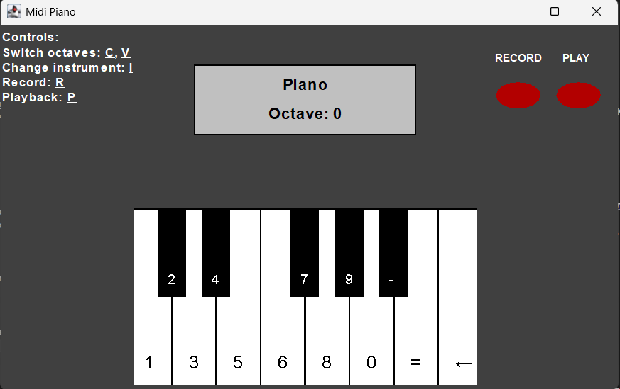
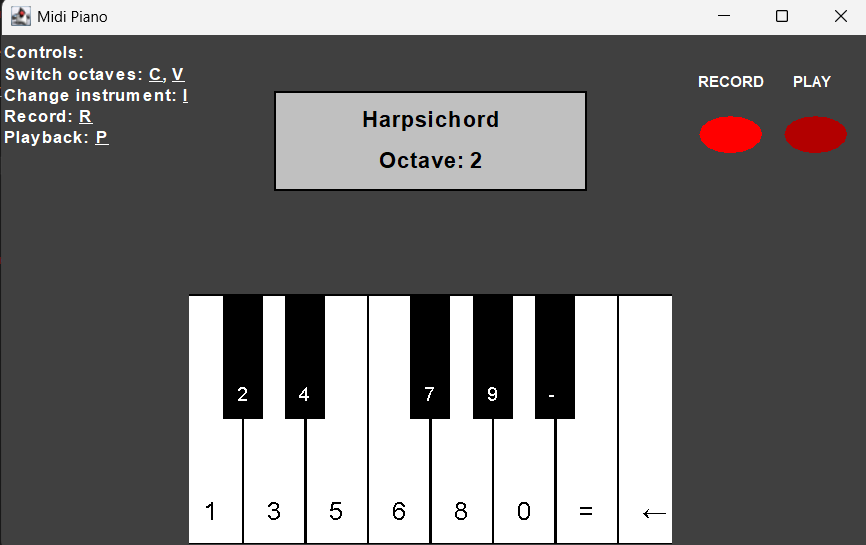
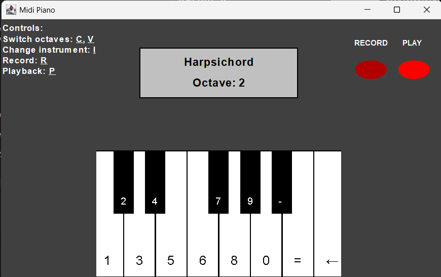
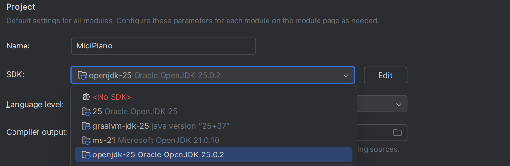

<h3 style="text-align: center;">
Міністерство Освіти і Науки України</h3>
<h3 style="text-align: center;">
Тернопільський національний технічний університет імені Івана Пулюя</h3>

   

Факультет комп’ютерно-інформаційних систем

та програмної інженерії

Кафедра “Програмної інженерії”

    

<h2 style="text-align: center; font-weight: bold;">
ЗВІТ
</h2>

З лабораторної роботи №2

на тему: "MIDI-piano"

З дисципліни:

"Конструювання програмного забезпечення"

        

Виконав:

ст. гр. СП-32

Валентин КИЧАН

  

Тернопіль 2026

## Загальний опис

У ході виконання лабораторної роботи було розроблено простий MIDI-синтезатор, який дозволяє відтворювати музичні ноти за допомогою клавіатури комп’ютера. Надано готовому застосунку зручний інтерфейс користувача.

Основною метою роботи було закріплення навичок написання специфікацій, розробки програм із використанням кінцевих автоматів, а також покриття функціоналу тестами.

Реалізований застосунок підтримує наступні можливості:

- відтворення нот (C, C#, D, …, B) за допомогою клавіш клавіатури;
- початок і завершення звучання нот через методи `beginNote` та `endNote`;
- перемикання MIDI-інструментів (`changeInstrument`);
- зміну октави (зсув на ±12 півтонів) за допомогою методів `shiftUp` та `shiftDown`;
- запис послідовності нот у режимі Recording (`toggleRecording`);
- відтворення записаної послідовності (`playback`) із збереженням ритму;
- коректну обробку введення під час відтворення.

Вихідний код програми розміщено у папці [main](lab-2-project/src/main) папки [src](lab-2-project/src)

---

## Приклади роботи

#### 1. Відтворення нот

При натисканні клавіші (наприклад, '1') викликається метод `beginNote`, який запускає відповідну ноту.  
При відпусканні клавіші викликається `endNote`, що зупиняє її звучання.

#### 2. Перемикання інструментів

Натискання клавіші 'I' викликає метод `changeInstrument`, який:
- змінює поточний інструмент на наступний;
- при досягненні кінця списку повертається до першого інструмента.

#### 3. Зміна октави

- 'C' — підвищення октави (`shiftUp`);
- 'V' — пониження октави (`shiftDown`).

Зміщення обмежене діапазоном ±2 октави від початкової, як було вказано у вимогах до лабораторної роботи.

#### 4. Запис та відтворення

- Натискання 'R' вмикає режим запису через метод `toggleRecording`;
- під час запису всі події нот зберігаються разом із часом;
- повторне натискання 'R' завершує запис;
- 'P' запускає відтворення через метод `playback`;

#### 5. Поведінка під час відтворення

Під час playback:
- введення з клавіатури й надалі обробляється стандартними обробниками подій (події `keydown/keyup` усе ще призводять до викликів `beginNote`/`endNote`), тому користувач може додатково грати ноти наживо під час відтворення;
- ноти відтворюються з правильними затримками, а не всі одночасно.

#### 6. Графічний інтерфейс користувача

Інтерфейс користувача було створено за зразком наданим у вимогах до лабораторної роботи. Він дозволяє бачити:
- Поточний інструмент;
- поточну октаву;
- коротку інструкцію з керуванням програмою;
- індикатори запису та відтворення, що активуються у відповідь на дії користувача. 

Рисунки нижче демонструють різні стани графічного інтерфейсу

Рисунок 1 - GUI програми 

Рисунок 2 - GUI програми в стані запису 

Рисунок 3 - GUI програми в стані відтворення відтворення 

## Тестування

Для перевірки коректності роботи програми було реалізовано unit-тести для основних методів класу `PianoMachine`. Тести розміщено у відповідній директорії проєкту [test](lab-2-project\src\test)

Було протестовано такі сценарії:

#### Методи `beginNote` та `endNote`
- перевірка початку звучання ноти;
- перевірка уникнення повторного запуску активної ноти;
- перевірка коректного завершення звучання.

#### Метод `changeInstrument`
- перемикання на наступний інструмент;

#### Методи `shiftUp` та `shiftDown`
- зміна октави в допустимому діапазоні;
- перевірка обмежень (±2 октави).

#### Методи `toggleRecording` та `playback`
- початок і завершення запису;
- очищення попереднього запису;
- відтворення послідовності з правильними часовими інтервалами.

Тестування дозволило виявити та виправити помилки у логіці роботи програми.

---
## Використання AI-інструментів

### Загальна інформація

В ході виконання лабораторної роботи було використано AI-інструменти з дотриманням рекомендацій щодо їх відповідального застосування у розробці програмного забезпечення.

**AI-інструменти, що використовувалися:**

- Gemini 3 (Google AI)
- ChatGPT (через інтеграцію з GitHub Copilot)

**Загальний обсяг AI-допомоги:** приблизно 20% від загального обсягу коду

Весь код, створений або змінений із використанням AI, був додатково проаналізований, адаптований та прокоментований відповідно до вимог лабораторної роботи.

---

### Детальний опис

#### Gemini 3

**Мета використання:**

- Поради в створенні методів
- Виправлення помилок у методах `PianoMachine`
- Допомога у написанні модульних тестів

**Результати:**

- Проасистовано частину методів для роботи з нотами та станами
- Виправлено логіку окремих методів (зокрема обробку подій)
- Частково згенеровано тести для перевірки функціоналу

**Перевірка якості:**

- Всі згенеровані рішення були перевірені та адаптовані
- Проведено тестування після внесення змін
- Код приведено у відповідність до структури проєкту

**Критична оцінка:**

- Добре підходить для швидкого отримання варіантів реалізації
- Потребує перевірки на відповідність логіці програми
- Не завжди враховує всі стани системи

---

#### ChatGPT (через GitHub Copilot)

**Мета використання:**

- Code review та генерація рекомендацій (suggestions)
- Покращення якості коду та стилю
- Виявлення неточностей у тестах та звіті

**Результати:**

- Виправлено один з тестів, що працював некоректно
- Усунено друкарські помилки (typos) у звіті
- Покращено неймінг внутрішніх полів класів
- Застосовано рекомендації щодо читабельності коду

**Перевірка якості:**

- Усі запропоновані зміни були перевірені вручну
- Внесені правки протестовані на відповідність очікуваній поведінці

**Критична оцінка:**

- Ефективний інструмент для code review
- Допомагає покращити якість та стиль коду
- Запропоновані зміни зазвичай точкові, але корисні
- Вимагає перевірки перед застосуванням

---

### Навчання та покращення навичок

**Знання, отримані від роботи з AI:**

- Краще розуміння підходів до організації коду
- Практика написання та перевірки тестів
- Розуміння важливості якісного неймінгу та документації

**Вплив на розвиток програмістських навичок:**

- Розвинено навички code review
- Покращено вміння аналізувати та інтегрувати зовнішні рішення
- Здобуто досвід роботи з AI як допоміжним інструментом, а не основним джерелом реалізації

**Виявлені обмеження AI:**

- AI не завжди враховує повний контекст проєкту
- Згенеровані рішення можуть потребувати адаптації
- Не замінює необхідність розуміння логіки програми

## Завдання на захист
**Оновити JDK до останньої версії LTS та оновити Gradle при потребі. Та показати на GitHub actions що тести працюють коректно після змін.**

На момент виконання лабораторної роботи останньою версією JDK, що має довготривалу підтримку є версія JDK 25. Також було оновлено Gradle до версії 9.1.0 яка підтримує таку версію Java, шляхом внесення змін у відповідні файли налаштувань Gradle. На рисунку нижче відображено зміну JDK для проєкту.

 

Рисунок 4 - Оновлення версії JDK до останньої версії LTS 

Для забезпечення надійної роботи тестів під час запуску GitHub actions було так само зредаговано версії інструментів у створеному файлі `lab-2-test` папки workflow.
## Висновки

У ході виконання лабораторної роботи було реалізовано MIDI-синтезатор із підтримкою відтворення, запису та обробки музичних нот.

Було покращено практичні навички з
- написання специфікацій методів;
- реалізації логіки на основі кінцевих автоматів;
- написання модульних тестів.

Реалізовано механізм запису та відтворення музичних послідовностей із збереженням ритму, а також усунуто проблему одночасного програвання нот під час playback.

